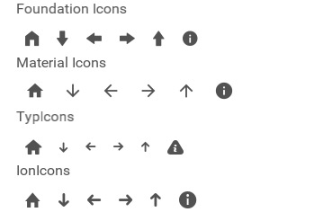

A collection of files with icon code mappings to quickly add icons to your fuse tools project. 

[Fuse Tools Icon Fonts Documentation](https://www.fusetools.com/docs/assets/iconfont-import)

Download the font file `.tff` and its associated `.js` file. The `Icons.ux` file is a global resource file, which creates the Icon Font resource. In the `.ux` file that you want to reference the font add the javascript file for the font `<JavaScript File="Resources/<icon-font>.js"/>`

You can then reference the icon like so

    <Text Value="{FiHome}" Font="{Resource FiIcons}" FontSize="22" Margin="10"/>

The `Value` is the font icon reference name with a prefix of the font initials.

## Foundation Icons
    Prefix: Fi
    Global Reference: {Resource FiIcons}
    number of icons: 336
https://zurb.com/playground/foundation-icon-fonts-3

## Material Icons
    Prefix: Mat
    Global Reference: {Resource MatIcons}
    number of icons: 991
https://material.io/icons/

## Typicons
    Prefix: Ti
    Global Reference: {Resource TiIcons}
    number of icons: 283
http://s-ings.com/typicons/

## Ionicons
    Prefix: Ion
    Global Reference: {Resource IonIcons}
    number of icons: 732
http://ionicons.com/

------------------------
### Preview

